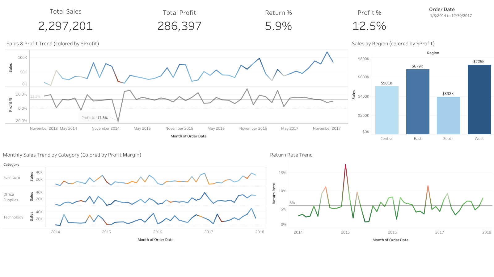
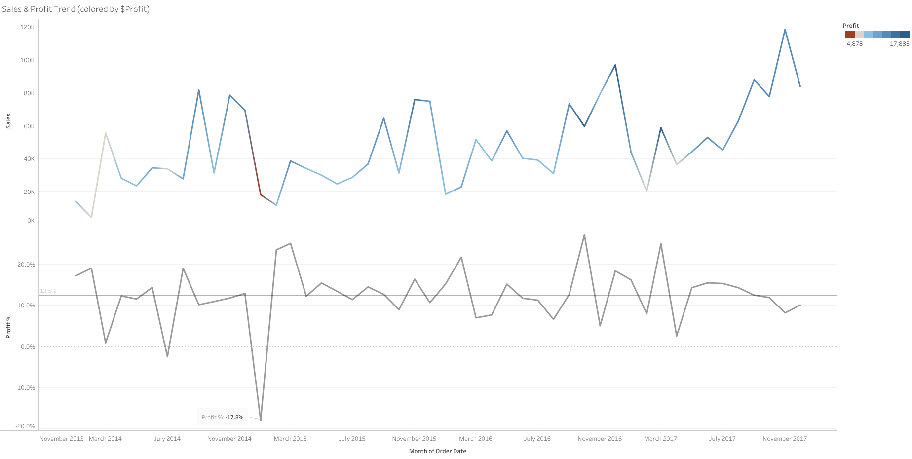
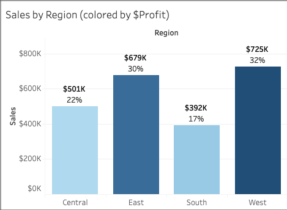
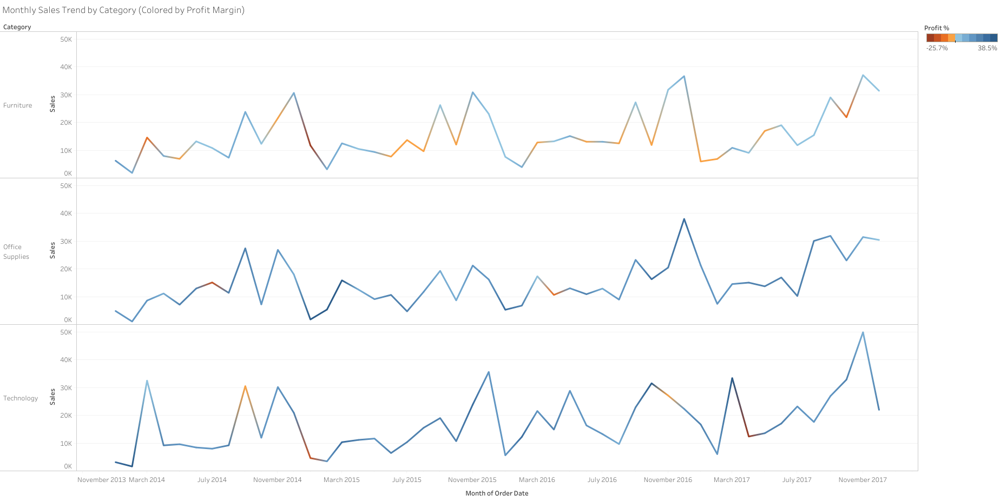
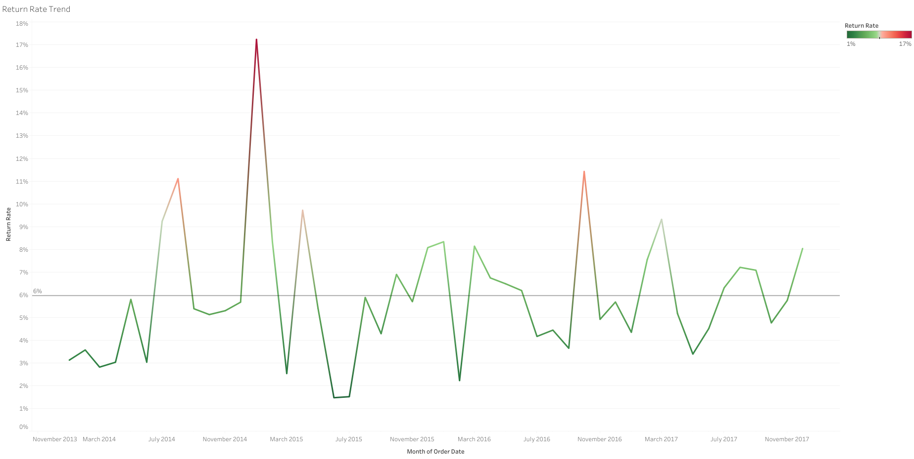

# tableau-sales-analytics

## 📊 Sales Performance & Profitability Dashboard (Tableau)
**[View Full Interactive Dashboard on Tableau Public](https://public.tableau.com/app/profile/shreyeshi.somya/viz/SalesPerformanceDashboard_17698490359220/Dashboard1)**



## Overview
This project presents an interactive Tableau dashboard designed to analyze **sales performance, profitability, and return behavior over time**.  
The analysis focuses on understanding not just *how much* revenue is generated, but **how margin quality and returns evolve across categories, regions, and time periods**.

The dashboard is built with a **business stakeholder mindset**, emphasizing clarity, comparability, and flexibility through interactive filtering and advanced analytics.

---

## Business Questions
This analysis answers the following key questions:

- How have **sales and profit margins trended over time**?
- Which product categories show **consistent vs volatile profitability**?
- How does **regional sales performance** compare when profitability is considered?
- Are **return rate spikes associated with margin compression**?
- How do these trends **change across different time windows**?
- What **percentage of total sales** does each region contribute?

---

## Key Metrics
- **Total Sales**
- **Total Profit**
- **Profit Margin (%)**
- **Return Rate (%)**
- **% of Total Sales by Region** (LOD calculation)

All metrics are calculated using aggregated values to ensure accurate financial interpretation.

---

## Advanced Features

### Interactive Dashboard Actions
- **Click-to-filter functionality:** Selecting a region in the "Sales by Region" chart dynamically filters all other visualizations
- Enables drill-down analysis without cluttering the interface
- Provides contextual exploration - click any region to see its specific performance across all metrics
- Clicking away resets the view to show all regions

### LOD (Level of Detail) Expressions
- Calculated **percentage of total sales by region** using FIXED LOD expression
- Formula: `SUM([Sales]) / SUM({ FIXED : SUM([Sales]) })`
- Demonstrates understanding of advanced Tableau calculations that operate across different aggregation levels
- Shows each region's contribution to company-wide performance regardless of filters

---

## Interactive Filtering

### Order Date Filter
The dashboard includes a **global Order Date filter** that allows users to dynamically adjust the analysis time frame.

- Implemented as a **date range selector**
- Applied consistently across **all worksheets**, including:
  - KPI summary tiles
  - Time-series trend charts
  - Category and regional breakdowns
- Enables flexible analysis of:
  - Short-term vs long-term trends
  - Periods of margin expansion or compression
  - Seasonal behavior

📌 **Design rationale:**  
Time-based filtering allows decision-makers to explore how performance patterns shift across different horizons without losing analytical context.

---

## Dashboard Walkthrough & Insights

### 1️⃣ KPI Summary

A top-level snapshot provides immediate context:
- Total Sales: **$2.3M**
- Total Profit: **$286K**
- Profit Margin: **12.5%**
- Return Rate: **5.9%**

📌 **Insight:** While overall margins appear healthy, deeper exploration by category and time period reveals significant volatility.

---

### 2️⃣ Sales & Profit Trend Over Time

This view separates **sales trends** and **profit margin trends** into two aligned panels:
- Monthly sales visualized as a time series
- Profit margin shown independently to avoid dual-axis distortion
- Reference line highlights the **average profit margin (12.5%)**
- Color encoding emphasizes strong vs weak profitability periods

📌 **Insight:** Periods of strong sales growth do not always align with margin expansion, indicating potential discounting or cost pressure.

---

### 3️⃣ Sales by Region (Interactive)


A regional comparison of total sales, colored by profit contribution:
- West and East regions generate the highest revenue
- Central and South regions lag in both sales and profitability
- **Each bar displays percentage of total sales** using LOD calculation:
  - West: 32% of total sales
  - East: 30% of total sales
  - Central: 22% of total sales
  - South: 17% of total sales

**Interactive Feature:**  
Click on any region bar to filter all other visualizations to that region's data. This enables focused analysis of regional performance across categories, time periods, and return rates.

📌 **Insight:** Revenue concentration does not necessarily imply margin efficiency. The West region contributes nearly one-third of total sales but South region shows lower profitability despite generating 17% of revenue.

---

### 4️⃣ Monthly Sales Trend by Category (Small Multiples)

Small multiple time series for:
- Furniture
- Office Supplies
- Technology

Each category includes:
- Monthly sales trend
- Color encoding by **profit margin**
- A **category-specific average margin reference line**

📌 **Insights:**
- **Technology** shows higher volatility but maintains stronger sustained margins
- **Furniture** experiences frequent margin dips despite relatively stable sales
- **Office Supplies** demonstrates steadier performance with fewer extreme swings

Using small multiples preserves category-level context while enabling comparison.

---

### 5️⃣ Return Rate Trend

The return rate is visualized as a monthly time series:
- Includes an average return rate benchmark (~6%)
- Highlights sharp spikes across the timeline

📌 **Insight:** Spikes in return rates often coincide with periods of margin compression, suggesting operational or customer-experience driven profit risk.

---

## Technical Approach

### Tools
- **Tableau Public** - Data visualization and dashboard creation

### Calculated Metrics

**Profit Margin (%)**  
```
SUM([Profit]) / SUM([Sales])
```

**Return Rate (%)**  
```
COUNTD([Order ID (Returns)]) / COUNTD([Order ID])
```

**% of Total Sales (LOD Expression)**  
```
SUM([Sales]) / SUM({ FIXED : SUM([Sales]) })
```
This FIXED LOD expression calculates each region's percentage contribution to total company sales, operating at a different aggregation level than the view's dimensions.

### Tableau Concepts Used
- Horizontal and vertical containers
- KPI tiles with custom alignment
- Global date filtering across worksheets
- **Dashboard actions for interactive filtering**
- **LOD (Level of Detail) expressions for advanced calculations**
- Small multiples for category comparison
- Reference lines scoped **per pane**
- Diverging color scales centered on meaningful benchmarks
- Custom tooltips for interpretability

---

## Design Principles
- Avoided dual-axis charts to reduce cognitive load
- Used small multiples instead of filters for category comparison
- Applied a **single global date filter** to maintain metric consistency
- Implemented **click-to-filter interactions** for intuitive exploration
- Centered color scales at zero or average values
- Prioritized business readability over visual density
- Used **LOD expressions** to show contextual metrics (% of total) alongside raw values

---

## 🛠️ Skills Demonstrated
- Interactive dashboard design with user-driven filtering
- Advanced calculations using LOD expressions
- Data relationship modeling (Orders, Returns, People tables)
- Business metric development (profit margin, return rate)
- Time-series analysis with reference lines
- Regional and categorical performance comparison
- Visual hierarchy and layout optimization
- Actionable insight generation from complex data

---

**Created by Shreyeshi Somya** | [LinkedIn](your-linkedin-url)
